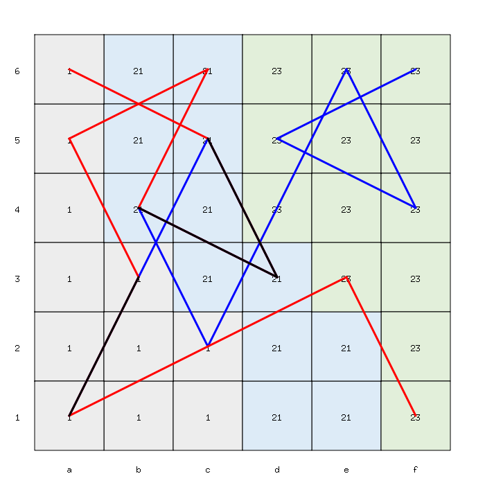
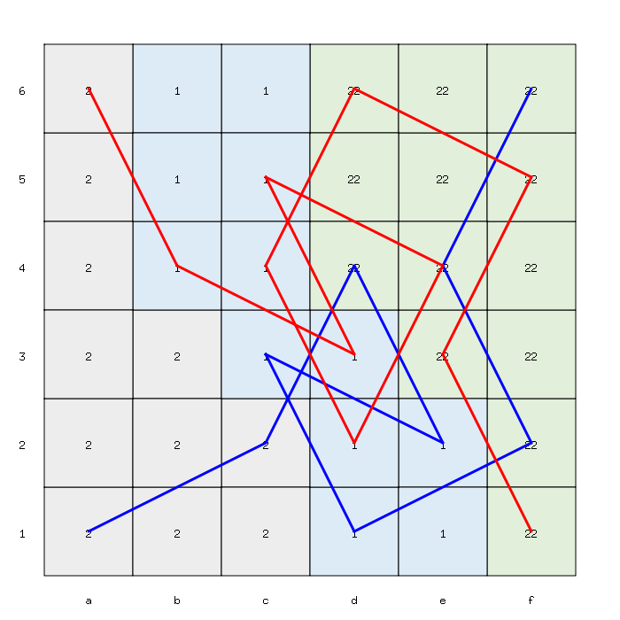

# Jane Street October 2024 Puzzle Solver


This solver was created to solve the “Knight Moves 6” puzzle, published on the Jane Street website in October 2024.

## Usage

Assuming that Go is installed on your system (if not: [how to install Go](https://go.dev/doc/install)), run:

```
$ go run main.go
```

## Solution

The solver converges on the optimal value by iterating through a set of candidate solutions and displaying the best one based on the A+B+C sum and the length of the paths.
Example: 

```
A: 1, B: 5, C: 4
(1) a1,c2,a3,b1,d2,c4,d6,b5,c3,e4,f6 (2) a6,b4,d5,b6,a4,b2,d1,e3,f1
Sum: 10 / Paths length: 20

A: 3, B: 2, C: 1
(1) a1,c2,e1,d3,e5,c6,a5,c4,a3,b5,c3,d5,e3,d1,f2,e4,f6 (2) a6,c5,a4,b2,d3,f2,d1,e3,c4,a5,c6,b4,d5,f6,e4,d2,f1
Sum: 6 / Paths length: 34

A: 1, B: 3, C: 2
(1) a1,c2,b4,c6,e5,c4,d6,f5,d4,b5,a3,b1,c3,e4,f6 (2) a6,b4,a2,c3,b1,d2,e4,d6,c4,e5,c6,a5,b3,d4,f5,e3,f1
Sum: 6 / Paths length: 32

A: 1, B: 3, C: 2
(1) a1,c2,b4,c6,e5,c4,d6,f5,d4,b5,a3,b1,c3,e4,f6 (2) a6,b4,c2,e1,f3,d2,e4,f6,d5,b6,a4,c3,d1,e3,f1
Sum: 6 / Paths length: 30
```

It also saves them as PNG images in the `./solutions` directory.

Here are some examples of solutions:

Sum: 45, with 22 visited squares 


Sum: 25, with 20 visited squares 


Sum: 14, with 26 visited squares 


Sum: 9, with 28 visited squares 


Sum: 8, with 30 visited squares 


Sum: 6, with 48 visited squares 


Sum: 6, with 30 visited squares  (optimal solution)


Each path is represented by a different color (red and blue), and overlapping paths are displayed in black.

Files are named following a specific convention to provide metadata about their creation. 

The filename consists of two numbers separated by a hyphen (`-`). 

* The first number is the sum of the values A, B, and C
* The second number is the actual length of both paths combined (_i.e.,_, the number of visited squares)

Example: `6-30.png` means that A+B+C=6 and the length of both paths is 30 visited squares.

